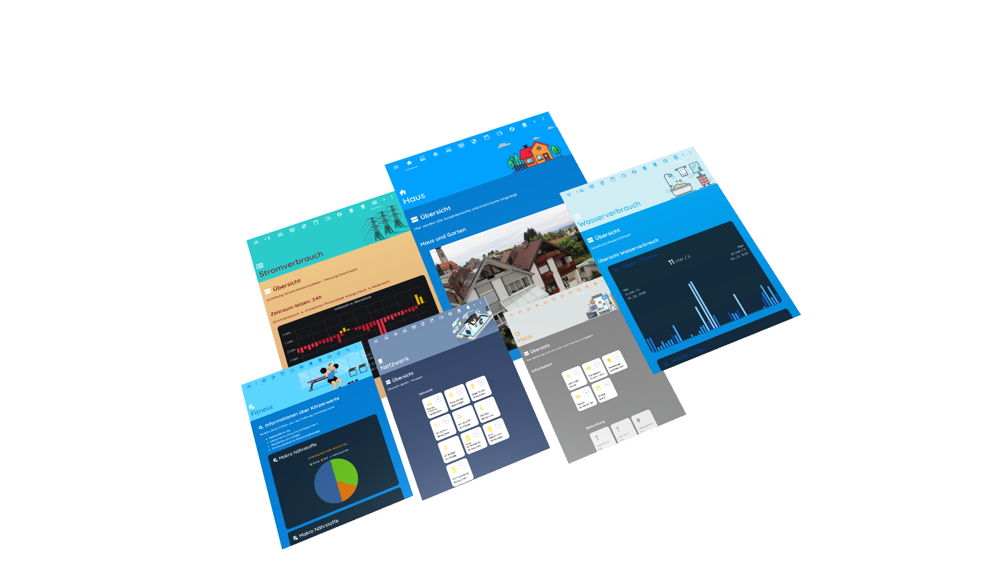

# Homeassitant Layout Card

> DEVELOPER PREVIEW VERSION NOT FINAL `Version 0.1.1`
I'm still looking for help and would be happy if someone would get in touch to help me complete and improve the cards-layout.





## Requirements

- Home Assistant 2021.1.4
  - Frontend-Version: 20201229.1 - latest
  - Lovelace Mode
- Tested Browser
  - Chrome Version 86.0.4240.111 
  - Safari Version 13.1.2 (13609.3.5.1.5)
  - Firefox 82.0 (64-Bit)
  - Vivaldi 3.4.2066.76 (Stable channel) (x86_64)
  - Android Browser (Chrome, Firefox, Vivaldi)


<br>

## Installation

### Manual install

1. Download the [latest release](https://github.com/zibous/ha-layoutcard/releases), unzip and copy the folder `cards-layout` into your `$HOME/homeassistant/.homeassistant/www/community/cards-layout` directory.
<br />

2. Add a reference to `cards-layout-min.js` inside your `ui-lovelace.yaml` or at the top of the *raw config editor UI*:

   ```yaml
      resources:
        - url: /hacsfiles/cards-layout/cards-layout-min.js
          type: module
   ```

<br>

## Options `layout`

| Name | Type | Default | Description
| ---- | ---- | ------- | -----------
| type | string | **Required** | `custom:cards-layout`
| toolbar | section | **Optional** | Settings for the toolbar
| header | section | **Optional** | Settings for the header below the toolbar
| page | section | **Optional** | Settings for the pag content
| content | section | **Required** | Section for content rows, columns, cards...
| footer | string | **Optional** | shows the footer text on the page (bottom)
| logger | boolean | **Optional** | Logs debug information in the console of your browser. Useful when you want to investigate or register an issue.

## Options `toolbar`

| Name | Type | Default | Example
| ---- | ---- | ------- | -----------
| backgroundcolor | string | **Optional** | `backgroundcolor: '#5CD5FE'`
| iconcolor | string | **Optional** | `iconcolor: '#047CD1'`
| visible | boolean | **Optional** | show or hide the toolbar

## Options `header`

| Name | Type | Default | Description
| ---- | ---- | ------- | -----------
| icon | string | **Optional** | Page header icon
| title | string | **Optional** | Page header title
| iconcolor | string | **Optional** | `iconcolor: '#047CD1'`
| style | string | **Optional** | CSS Style tags for header

## Options `page`

| Name | Type | Default | Description
| ---- | ---- | ------- | -----------
| icon | string | **Optional** | Page page icon
| title | string | **Optional** | Page page title
| iconcolor | string | **Optional** | `iconcolor: '#047CD1'`
| description | string | **Optional** | Card section text
| style | string | **Optional** | CSS Style tags for header
| content | section | **Optional** | Section for content rows, columns, cards...
| locale | string | **Optional** | formats the numbers according to the locale and formatting options and set the data string with a language sensitive representation of the date portion of the date


## Options layout `content`
| Name | Type | Default | Description
| ---- | ---- | ------- | -----------
| content |section | **Required** | ection for content rows, columns, cards...


## Options layout `row`

| Name | Type | Default | Description
| ---- | ---- | ------- | -----------
| row |section | **Required** | section for columns

## Options layout `col`

| Name | Type | Default | Description
| ---- | ---- | ------- | -----------
| columns | section  | **Required** | columns container for cards
| title | string | **Optional** | title
| description | string | **Optional** | Card section text
| width | number, string | **Required** | max width card row or column
| height | number, string | **Required** | max width card row or column
| entities | list | **Required** | List of cards

## Options layout `col entities`

| Name | Type | Default | Description
| ---- | ---- | ------- | -----------
| entities | list | **Required** | List of cards
| type | string | **Required** | `card type`
| style | string | **Optional** | CSS Style tags for the card


### Entity Style examples
```yaml
- type: 'custom:simple-card'
   style: >
       background: linear-gradient(to top, #fc4a1a, #f7b733);
       color:#FFFFFF;
       height: 220px;


```

## Using the card
Add a custom card in your `ui-lovelace.yaml`

**Example**
```yaml
views:
  - title: Custom Layout card testcase
    panel: true
    cards:
      - type: 'custom:cards-layout'
        header:
          title: My House
          icon: 'mdi:home'
          style: >-
              background-image: url('/hacsfiles/cards-layout/assets/ui-ux.png');
              background-color: rgb(106, 115, 126);
        page:
          title: Page Title
          icon: 'mdi:view-agenda'
          description: >-
             Description Section 1 Lorem ipsum dolor sit amet, consetetur
             sadipscing elitr
          style: |
             color: #FFFFFF;
             background: #bdc3c7; 
             background: linear-gradient(to top, #bdc3c7, #2c3e50);")
          width: 80%
        content:
          - row:
              - columns: null
                width: 100%
                title: Section 1
                description: >-
                  Description Section 1 Lorem ipsum dolor sit amet, consetetur
                  sadipscing elitr, sed diam nonumy eirmod tempor invidunt ut
                  labore et dolore magna aliquyam erat, sed diam voluptua. At
                  vero eos et accusam et justo duo dolores et ea rebum. Stet
                  clita kasd gubergren, no sea takimata sanctus est Lorem ipsum
                  dolor sit amet.
                entities:
                  - type: picture
                    title: Card 1 Section 1
                    style: 'ha-card {transform: scale(0.95);}'
                    image: >-
                      https://images.unsplash.com/photo-1512917774080-9991f1c4c750?ixlib=rb-1.2.1&ixid=eyJhcHBfaWQiOjEyMDd9&auto=format&fit=crop&w=800&h=600&q=80
          - row:
              - columns: null
                width: 50%
                title: Section 2
                description: >-
                  Description Section 2 Lorem ipsum dolor sit amet, consetetur
                  sadipscing elitr, sed diam nonumy eirmod tempor invidunt ut
                  labore et dolore magna aliquyam erat, sed diam voluptua. At
                  vero eos et accusam et justo duo dolores et ea rebum. Stet
                  clita kasd gubergren, no sea takimata sanctus est Lorem ipsum
                  dolor sit amet.
                entities:
                  - type: picture
                    title: Card 1 Section 2
                    style: 'ha-card {transform: scale(0.95);}'
                    image: >-
                      https://images.unsplash.com/photo-1521446477144-773b2dd9b1af?ixlib=rb-1.2.1&ixid=eyJhcHBfaWQiOjEyMDd9&auto=format&fit=crop&w=800&h=600&q=80
                  - type: picture
                    title: Card 2 Section 2
                    style: 'ha-card {transform: scale(0.95);}'
                    image: >-
                      https://images.unsplash.com/photo-1546551613-09c2f83e1ede?ixlib=rb-1.2.1&ixid=eyJhcHBfaWQiOjEyMDd9&auto=format&fit=crop&w=800&h=600&q=80
          - row:
              - columns: null
                width: 50%
                title: Section 3
                description: >-
                  Description Section 3 Lorem ipsum dolor sit amet, consetetur
                  sadipscing elitr, sed diam nonumy eirmod tempor invidunt ut
                  labore et dolore magna aliquyam erat, sed diam voluptua. At
                  vero eos et accusam et justo duo dolores et ea rebum. Stet
                  clita kasd gubergren, no sea takimata sanctus est Lorem ipsum
                  dolor sit amet.
                entities:
                  - type: picture
                    title: Card 1 Section 3
                    style: 'ha-card {transform: scale(0.95);}'
                    image: >-
                      https://images.unsplash.com/photo-1560635921-171138a3955e?ixlib=rb-1.2.1&ixid=eyJhcHBfaWQiOjEyMDd9&auto=format&fit=crop&w=800&h=600&q=80
                  - type: picture
                    title: Card 2 Section 3
                    style: 'ha-card {transform: scale(0.95);}'
                    image: >-
                      https://images.unsplash.com/photo-1545022274-cdffe6d68075?ixlib=rb-1.2.1&ixid=eyJhcHBfaWQiOjEyMDd9&auto=format&fit=crop&w=800&h=600&q=80
                  - type: picture
                    title: Card 3 Section 3
                    style: 'ha-card {transform: scale(0.95);}'
                    image: >-
                      https://images.unsplash.com/photo-1598928506311-c55ded91a20c?ixlib=rb-1.2.1&auto=format&fit=crop&w=800&h=600&q=80                      
                  - type: picture
                    title: Card 4 Section 3
                    style: 'ha-card {transform: scale(0.95);}'
                    image: >-
                      https://images.unsplash.com/photo-1593853885764-b1174d704401?ixlib=rb-1.2.1&ixid=eyJhcHBfaWQiOjEyMDd9&auto=format&fit=crop&w=800&h=600&q=80      
          - row:
              - columns: null
                width: 100%
                title: Section 4
                description: >-
                  Description Section 4 Lorem ipsum dolor sit amet, consetetur
                  sadipscing elitr, sed diam nonumy eirmod tempor invidunt ut
                  labore et dolore magna aliquyam erat, sed diam voluptua. At
                  vero eos et accusam et justo duo dolores et ea rebum. Stet
                  clita kasd gubergren, no sea takimata sanctus est Lorem ipsum
                  dolor sit amet.
                entities:
                  - type: picture
                    title: Card 1 Section 4
                    style: 'ha-card {transform: scale(0.95);}'
                    image: >-
                      https://images.unsplash.com/photo-1544984243-ec57ea16fe25?ixlib=rb-1.2.1&ixid=eyJhcHBfaWQiOjEyMDd9&auto=format&fit=crop&w=800&h=600&q=80

```

<a href="https://www.buymeacoff.ee/zibous" target="_blank"></a>

## TODO
- better css handling (load css once not per card)
- initialize - render cards to stage, re-assign to root
- how to handle end devices with low bandwidth, currently shows error-hui card when loading ?
- ~~how to call hass and config for a custom:card (update data custom:card do not work !) ?~~  -->  this.provideHass(element);

## Helper
- [YAML to JSON Online](https://www.convertjson.com/yaml-to-json.htm) - Use this online tool to convert YAML into JSON. 
- [JSON to YAML Online](https://www.convertjson.com/json-to-yaml.htm) - Use this online tool to convert JSON into YAML. 
- [uiGradients](https://uigradients.com/#ByDesign)  - Beautiful colored gradients
- [Unsplash](https://unsplash.com/) - The internet’s source of freely-usable images.
- [100 awesome illustration](https://illlustrations.co) - Open source illustrations kit
- [Grafik - Ressourcen für jedermann](https://de.freepik.com) - Kostenlose Vektoren, PSD und Bilder

## Credits

- [Ofek Ashery](https://github.com/ofekashery/vertical-stack-in-card) - Vertical Stack In Card allows you to group multiple cards in one card.
- [ciotlosm](https://github.com/ciotlosm)
- [thomasloven](https://github.com/thomasloven)
